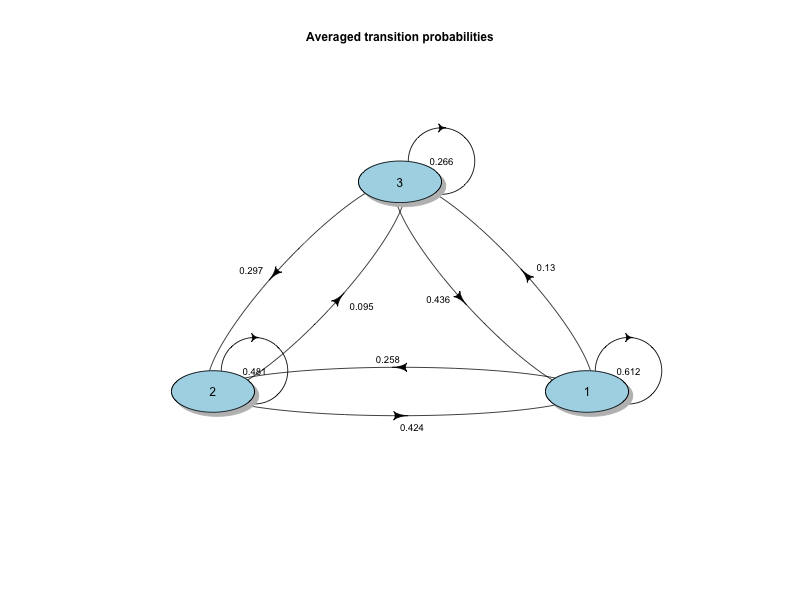
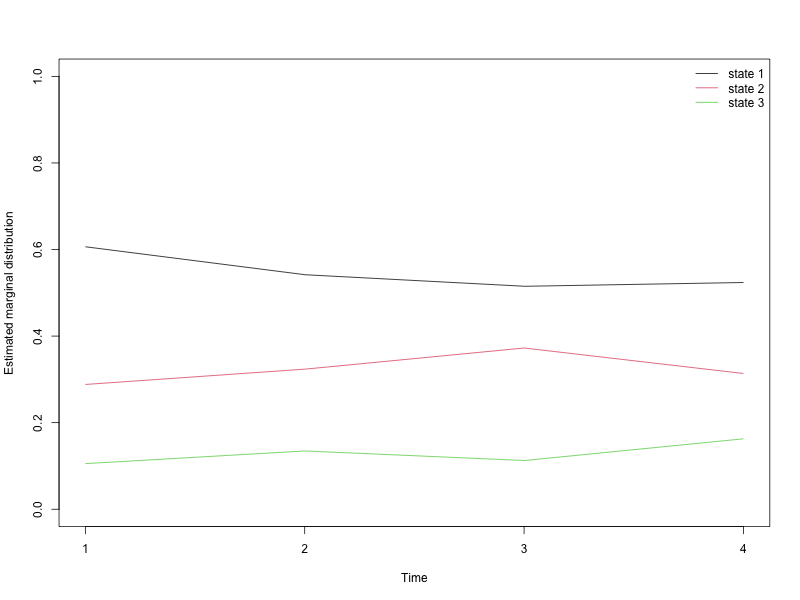
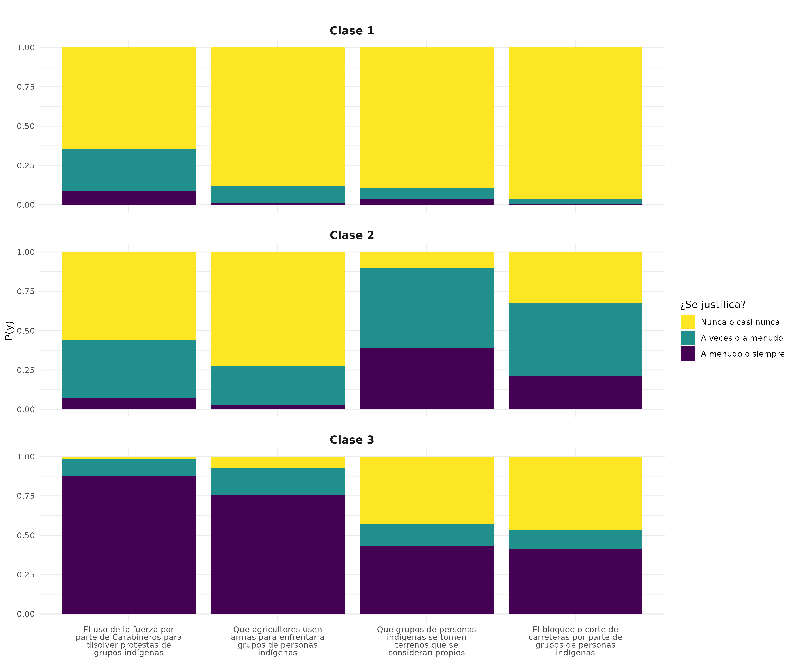

```{r setup, include=FALSE}
knitr::opts_chunk$set(echo = TRUE)
```

## Introducción

Relaciones interculturales

}Teoría del contacto intergrupales

-- Posturas cognitivas -- Patrones de interacción -- \* Estructura relacionales (Relaciones de contacto. Amigos, frecuencia de datos)

-   Estructura normativa (familia informal)

## Desarrollo

## Metodología

ELRI, panel longitudinal....

ELRI posee una batería de preguntas que pueda estudiar esto, pero no con SEM por la cantidad de ítem.

ELRI captura de manera eficiente la violencia de una manera dual: Violencia desde indígenas y violencia hacia indígenas. En total, son 4 preguntas longitudinales (presentes en las cuatro olas).

Las variables para construir posibles modelos latentes son:

`d3_1` (Violencia contra indígenas) ¿En qué medida cree usted que se justifican o no se justifica...El uso de la fuerza por parte de Carabineros para disolver protestas cometidas por grupos de personas indígenas?

`d3_2` (Violencia contra indígenas) ¿En qué medida cree usted que se justifican o no se justifica...Que agricultores usen armas para enfrentar a grupos de personas indígenas?

`d4_2` (Violencia indígena) ¿En qué medida cree usted que se justifican o no se justifica...Que grupos de personas indígenas se tomen terrenos que se consideran propios?

`d4_3` (Violencia indígena) ¿En qué medida cree usted que se justifican o no se justifica..El bloqueo o corte de carreteras por parte de grupos de personas indígenas

**Variables que pueden predecir de forma longitudinal la pertenencia a la clase.**

`c1 : Como le cane los chilenos indígenqas`

`c2 : Colo le caen los chilenos no indígenas`

`d5_1`: Carabineros tratan a las personas indígenas con respeto [Justicia procidimental]

`d5_2:` Carabineros tratan a las personas no indígenas con respeto [Justiciai procidimental]

d6_1: identificación cuasa indígena

`c27_1`: Se respeta a los indígenas

`c27_3`: Se respeta a los chilenos no indígenas

`D7_X y D8_X:` Escala de Autoritarismo de Derecha. [Ver info](https://mideuc.cl/wp-content/uploads/2022/11/Autoritarismo-de-Derecha_documentacion-de-instrumento.pdf)

`d10_X`: Escala de dominancia social

## Resultado

### Transiciones entre las clases



### Estabilidad de las clases



### Construcción de clase latentes



## Conclusiones
